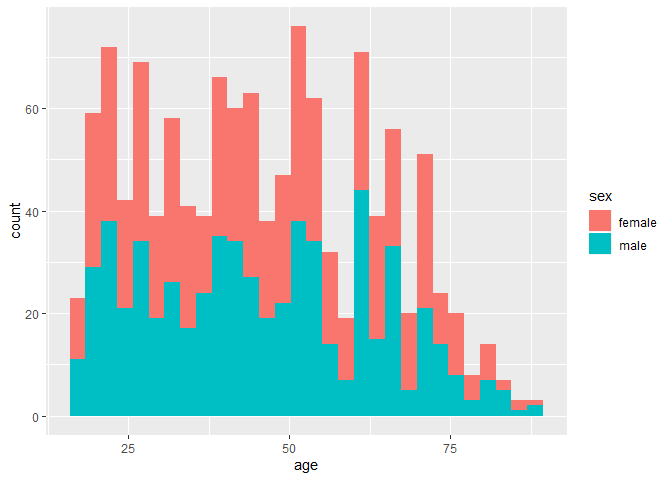
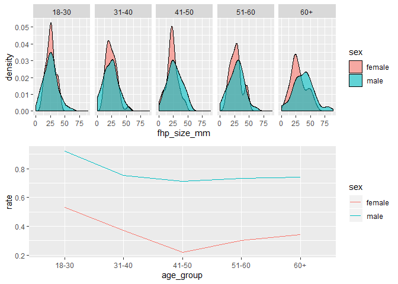
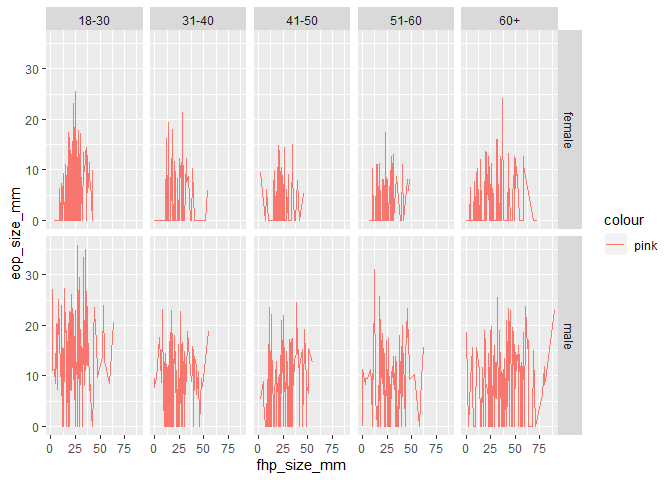

midterm\_project
================
Mengyuan Li
10/19/2019

``` r
library(tidyverse)
```

    ## -- Attaching packages ------------------------------------------------------------------ tidyverse 1.2.1 --

    ## v ggplot2 3.2.1     v purrr   0.3.2
    ## v tibble  2.1.3     v dplyr   0.8.3
    ## v tidyr   1.0.0     v stringr 1.4.0
    ## v readr   1.3.1     v forcats 0.4.0

    ## -- Conflicts --------------------------------------------------------------------- tidyverse_conflicts() --
    ## x dplyr::filter() masks stats::filter()
    ## x dplyr::lag()    masks stats::lag()

``` r
library(readxl)
library(ggplot2)
library(gridExtra)
```

    ## 
    ## Attaching package: 'gridExtra'

    ## The following object is masked from 'package:dplyr':
    ## 
    ##     combine

# problem 1 - Data

``` r
data = read_excel("data_set.xlsx", skip = 8) 
data = janitor::clean_names(data)
data = mutate(data, sex = factor(sex, levels = c(0,1), 
                                 labels = c("female", "male"))) %>%
                   mutate(eop_size_mm = replace(eop_size_mm, is.na(eop_size_mm), 0),
                          eop_shape = factor(eop_shape))
  


data_1 = data %>%
  group_by(sex) %>%
  ggplot(aes(age, fill = sex)) + geom_histogram() 
data_1
```

    ## `stat_bin()` using `bins = 30`. Pick better value with `binwidth`.

<!-- -->
Description of Data Cleaning Process: I changed the variables’ names to
lower-cased and readable names using “janitor clean”, and coverted “0,1”
under column “sex” to “female” and “male” using function “factor”. At
the last step, I replaced all of the missing values by 0 by applying the
function “replace”.

Indentification of Key Variables: In the resulting dataset, “sex”,
“age”, and “FHP size” are three key variables. By categoring male
and female into different groups, researchers can see how sex relates to
exostosis. Also, enthesophyte size might vary by age, which can be
checked by detecting ages. Also, “FHP size” is a key because it’s the
main factor we focus on.

Declare of Distribution: There are 1221 participants. By looking at the
hitogram I ploted, we can see that the distribution of ages are very
similar among males and females. The only difference is that the number
of females among all ages is greater than the number of males.

Issues in Existing Dataset: For variable “age\_group”, it is very
confused to represent ages over 60 as “6,7,8”. It’s enough to use “6”
instead of three numbers. Also, the way to covert continuous variables
to categorical variables are not correct. For example, 10-15 mm eop size
is indicated by 2, and 15-20 mm eop size is indicated by 3. So, for eop
size equal to 15, it’s a trouble to get corrosponding indicator.

# problem 2 - Visualization

``` r
data_2 = data %>%
  mutate(age_group = factor(age_group, levels = c(1,2,3,4,5,6,7,8), labels = c("1-17", "18-30", "31-40", "41-50", "51-60", "60+", "60+", "60+"))) %>%
  drop_na() %>%
  filter(!(age_group == "1-17")) %>%
  group_by(age_group, sex) 

p1 = ggplot(data_2, aes(x = fhp_size_mm,  fill = sex)) + geom_density(alpha = .6) + facet_grid(~age_group)
data_2
```

    ## # A tibble: 693 x 9
    ## # Groups:   age_group, sex [10]
    ##    sex     age age_group eop_size_mm eop_size eop_visibility_~ eop_shape
    ##    <fct> <dbl> <fct>           <dbl> <chr>               <dbl> <fct>    
    ##  1 male     18 18-30            14.8 2                       2 3        
    ##  2 male     26 18-30            17.1 3                       2 3        
    ##  3 male     20 18-30            23.9 4                       2 1        
    ##  4 fema~    28 18-30             7.9 1                       2 2        
    ##  5 male     21 18-30             9.4 1                       2 2        
    ##  6 male     30 18-30            16.5 3                       2 2        
    ##  7 male     27 18-30            22.8 4                       2 1        
    ##  8 male     30 18-30            17.8 3                       2 2        
    ##  9 male     21 18-30            12.2 2                       2 2        
    ## 10 male     23 18-30            11.2 2                       2 1        
    ## # ... with 683 more rows, and 2 more variables: fhp_size_mm <dbl>,
    ## #   fhp_category <chr>

``` r
data_3_1 = data %>%
  mutate(age_group = factor(age_group, levels = c(1,2,3,4,5,6,7,8), labels = c("1-17", "18-30", "31-40", "41-50", "51-60", "60+", "60+", "60+"))) %>%
  filter(!(age_group == "1-17")) %>%
  group_by(age_group, sex) %>%
  summarise(total_people = n()) 

data_3_2 = data %>%
  mutate(age_group = factor(age_group, levels = c(1,2,3,4,5,6,7,8), labels = c("1-17", "18-30", "31-40", "41-50", "51-60", "60+", "60+", "60+"))) %>%
  filter(!(age_group == "1-17")) %>%
  group_by(age_group, sex) %>%
  filter(eop_size != 0) %>%
  summarise(enlarged_eop_people = n()) %>%
  select(enlarged_eop_people)
```

    ## Adding missing grouping variables: `age_group`

``` r
data_3 = bind_cols(data_3_1, data_3_2) %>%
  mutate(rate = enlarged_eop_people/total_people)

p2 = ggplot(data_3,aes(group = sex, x = age_group, y = rate)) + geom_line(aes(color = sex))
data_3
```

    ## # A tibble: 10 x 6
    ## # Groups:   age_group [5]
    ##    age_group sex    total_people age_group1 enlarged_eop_people  rate
    ##    <fct>     <fct>         <int> <fct>                    <int> <dbl>
    ##  1 18-30     female          151 18-30                       80 0.530
    ##  2 18-30     male            152 18-30                      140 0.921
    ##  3 31-40     female          102 31-40                       38 0.373
    ##  4 31-40     male            102 31-40                       77 0.755
    ##  5 41-50     female          106 41-50                       23 0.217
    ##  6 41-50     male            101 41-50                       72 0.713
    ##  7 51-60     female           99 51-60                       30 0.303
    ##  8 51-60     male            101 51-60                       74 0.733
    ##  9 60+       female          155 60+                         53 0.342
    ## 10 60+       male            150 60+                        111 0.74

``` r
final_plot = grid.arrange(p1, p2, nrow = 2)
```

<!-- -->

``` r
final_plot
```

    ## TableGrob (2 x 1) "arrange": 2 grobs
    ##   z     cells    name           grob
    ## 1 1 (1-1,1-1) arrange gtable[layout]
    ## 2 2 (2-2,1-1) arrange gtable[layout]

``` r
data_4 = data %>%
  mutate(age_group = factor(age_group, levels = c(1,2,3,4,5,6,7,8), labels = c("1-17", "18-30", "31-40", "41-50", "51-60", "60+", "60+", "60+"))) %>%
  filter(!(age_group == "1-17")) %>%
  select(age_group, sex, eop_size_mm, fhp_size_mm) %>% 
  ggplot(aes(x = fhp_size_mm, y = eop_size_mm, color = "pink")) +
  geom_line() +
  facet_grid(vars(sex), vars(age_group)) + 
  viridis::scale_fill_viridis(discrete = TRUE)
data_4
```

    ## Warning: Removed 1 rows containing missing values (geom_path).

<!-- -->

Comment: In each group, females have higher average FHP size than males.
Males have larger EOP sizes compared to females. Males have higher rate
of getting EEOP. I am interested in the question “what is the
relationship between EOP size and FPH size for both males and females”.

# problem 3 - Reproducing reported results

``` r
data_count = data %>%
  mutate(age_group = factor(age_group, levels = c(1,2,3,4,5,6,7,8), labels = c("1-17", "18-30", "31-40", "41-50", "51-60", "60+", "60+", "60+"))) %>%
  group_by(age_group) %>% 
  summarise(number_of_people = n())

data_mean = data %>%
  drop_na() %>%
  filter(age_group != 1) %>%
  group_by(sex) %>%
  select(fhp_size_mm) %>%
  mutate(average_fhp = mean(fhp_size_mm), sd_of_fhp = sd(fhp_size_mm)) %>%
  select(-fhp_size_mm)
```

    ## Adding missing grouping variables: `sex`

``` r
data_mean = unique(data_mean, fromLast = TRUE)


data_prevelence = data %>%
  filter(!(eop_size == 0)) %>% 
  filter(! (eop_size == 1)) %>%
  filter(!(age_group == 1))

number_of_diseased_people = nrow(data_prevelence)

total_people = nrow(data)

prevalence = number_of_diseased_people/total_people
prevalence
```

    ## [1] 0.3226863

``` r
data_FHP = data %>%
  filter(fhp_size_mm > 40) %>%
  filter(age_group %in% c(6, 7, 8))
number_of_target = nrow(data_FHP)


total_people = data %>%
  filter(age_group %in% c(6,7,8))
total_people = nrow(total_people)

FHP_frequency = number_of_target/total_people
FHP_frequency
```

    ## [1] 0.3245902

Comment: the sample size is not consistent with the data. FHP mean(sd)
is consistent with my data. EEOP is enlarged EOP. We can use “eop\_size”
to evaluate this claim. Prevalence is a little bit different from
authors’ finding. The frequency of FHP is broad trendily consistent with
my data. But the specific value is not consistent.

# problem 4

There are 2 observations of age 1-17, 303 observations of age 18-30, 204
observations of age 31-40, 207 observations of age 41-50, 200
observations of age 51-60, and 305 observations over 60. The prevalence
of EEOP is 57.2%. The frequently of FHP \> 40 mm in the over 60s cases
is 32.4%. My reports are different from what the authors have. The
reason is that my reports are generated by a flawed dataset where many
variables are not clearly defined. Based on the evidence, I do not think
cell causes horn growth. We need to address the date of specific cell
phone using time in order to make strong evidence.
